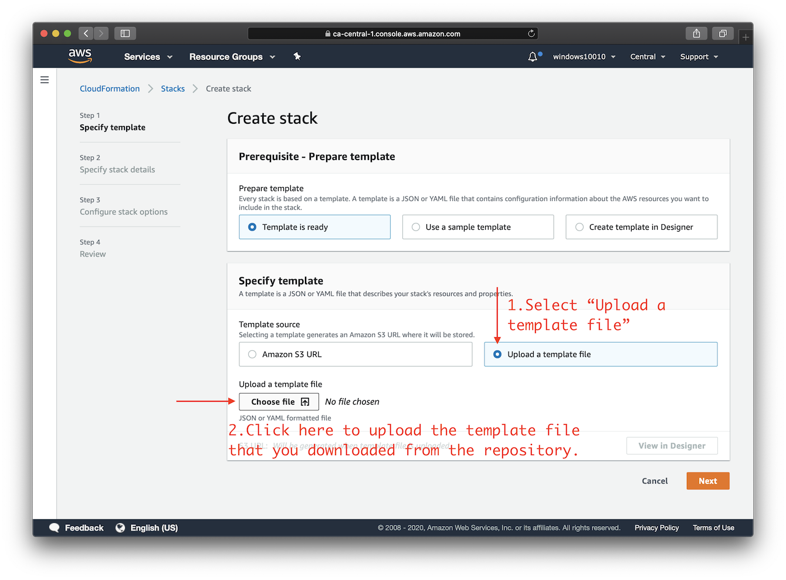
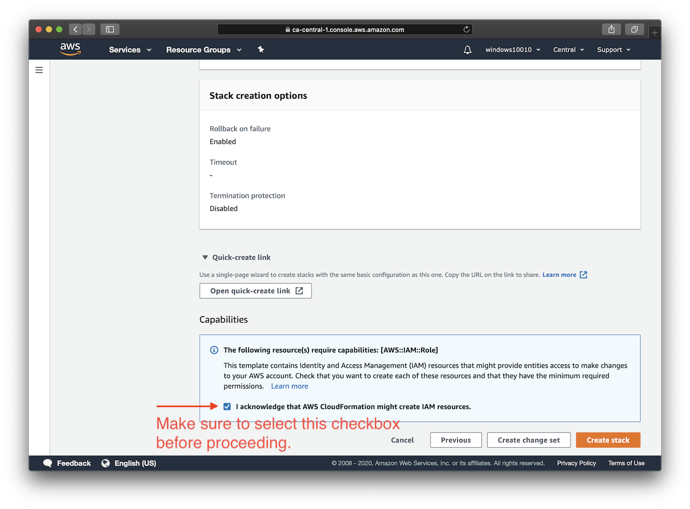

# Deploy to Amazon EC2 using CloudFormation (Beta)

*Read this in other languages: [English](README.md), [简体中文](README-zh.md).*

> **Note:** This deployment template is still in **BETA**. You may encounter failures during deployment. In that case, please open a new issue.

This template will create a fully-working IPsec VPN server on Amazon Elastic Compute Cloud (Amazon EC2). Please make sure to check the EC2 [pricing details](https://aws.amazon.com/ec2/pricing/on-demand/) before continuing. Using a `t2.micro` server instance for your deployment may qualify for the [AWS Free Tier](https://aws.amazon.com/free/).

Available customization parameters:

- Amazon EC2 instance type
- OS for your VPN server (Ubuntu 20.04/18.04/16.04, Debian 9)
> **Note:** Before using the Debian 9 image on EC2, you need to first subscribe at the AWS Marketplace: [Debian 9](https://aws.amazon.com/marketplace/pp/B073HW9SP3).
- Your VPN username
- Your VPN password
- Your VPN IPsec PSK (pre-shared key)

> **Note:** DO NOT use these special characters within values: `\ " '`

Make sure to deploy this template with an **AWS Account Root User** or an **IAM Account** with **Administrator Access**.

Right-click this [**template link**](https://raw.githubusercontent.com/hwdsl2/setup-ipsec-vpn/master/aws/cloudformation-template-ipsec) and save as a file on your computer. Then upload it as the template source in the stack creation wizard.

At step 4, make sure to confirm that this template may create IAM resources.

Click the icon below to start:

You may choose an AWS region using the selector to the right of your account information on the navigation bar. After you click "create stack" in the final step, please wait for the stack creation and VPN setup to complete, which may take up to 15 minutes. As soon as the stack's status changes to **"CREATE_COMPLETE"**, you are ready to connect to the VPN server. Click the **Outputs** tab to view your VPN login details. Then continue to [Next steps: Configure VPN Clients](../README.md#next-steps).

## FAQs

How to connect to the server via SSH after deployment?

  
Amazon EC2 does not allow users to access newly created instances with an SSH password. Instead, users are required to create "key pairs", which are used as credentials for SSH access.

This template generates a key pair for you during deployment, and the private key will be available as text under the **Outputs** tab after the stack is successfully created.

You will need to save the private key from the **Outputs** tab to a file on your computer, if you want to access the VPN server via SSH.

> **Note:** You may need to format the private key by replacing all spaces with newlines, before saving to a file.

## Author

Copyright (C) 2020 [S. X. Liang](https://github.com/scottpedia)

## Screenshots

